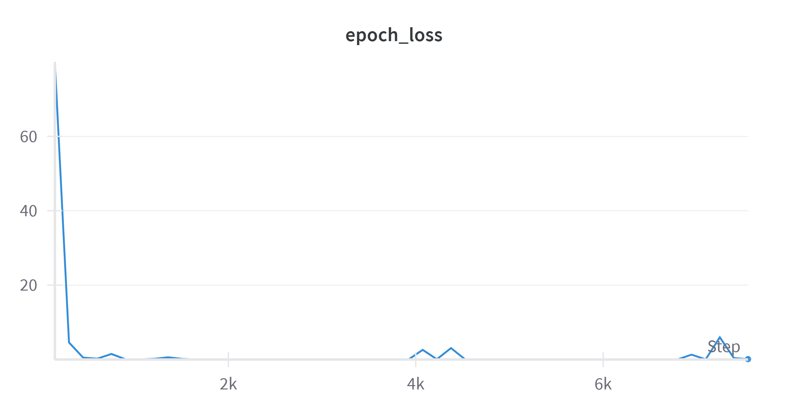
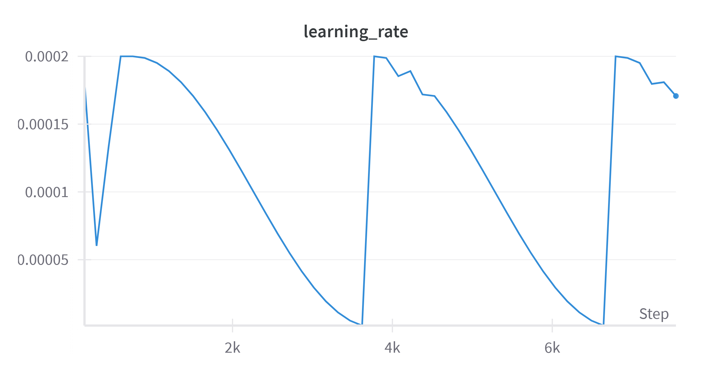
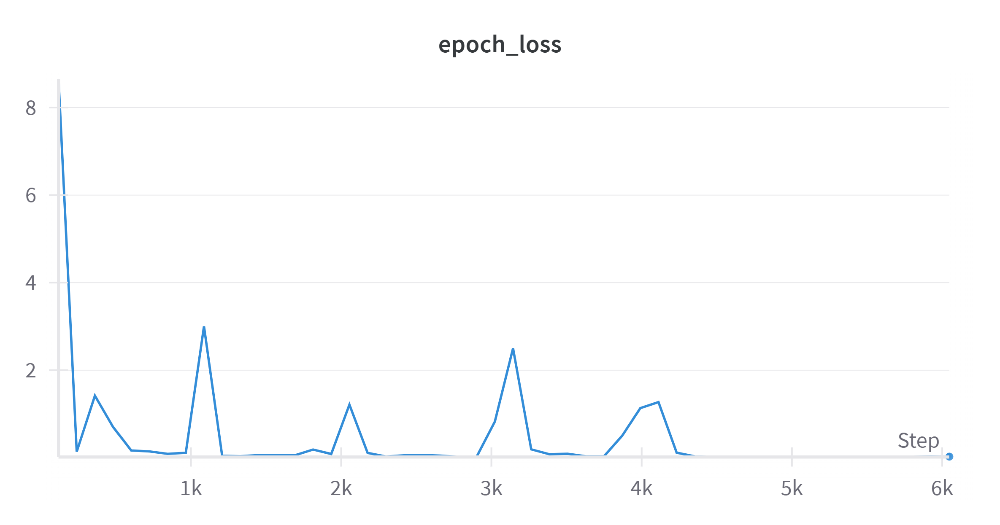
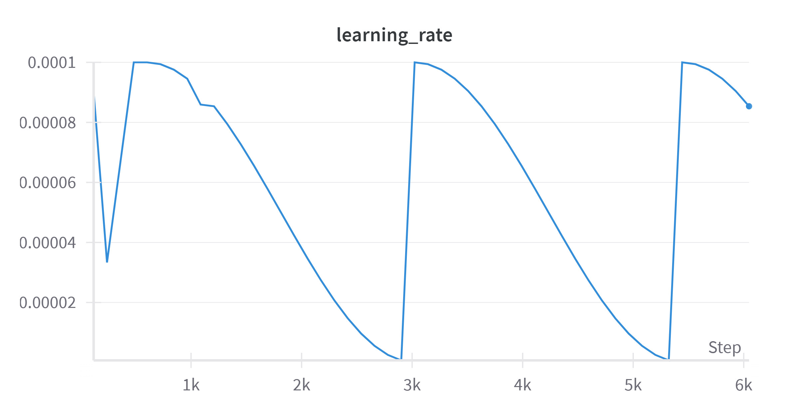

# MedSegDiff-Jittor

基于 Jittor 框架复现的 MedSegDiff 医学图像分割扩散模型

## 概述

本项目基于 Jittor 深度学习框架复现了 MedSegDiff 模型，该模型包含 4 个变体：
- **MedSegDiff-S** - 轻量化版本
- **MedSegDiff-B** - 基础版本  
- **MedSegDiff-L** - 大型版本
- **MedSegDiff++** - 增强版本

模型在 3 个医学图像分割数据集上进行了测试：
- **BraTS-2021** - 脑肿瘤分割
- **REFUGE-2** - 视网膜图像分割
- **DDTI** - 皮肤病变分割

同时进行了消融实验，验证 Dynamic Conditional Encoding 和 FF-Parser 模块的有效性，使用 Dice 和 IoU 指标评估模型性能。

## 系统要求

- **操作系统**: Ubuntu 22.04 (推荐使用 WSL2)
- **Python**: 3.7
- **CUDA**: 支持 CUDA 12.2+ (可选，用于 GPU 加速)
- **依赖管理**: 见 `requirements.txt` 文件

## 计算资源

- **CPU**: 12th Gen Intel(R) Core(TM) i7-12700H
- **RAM**: 16GB
- **GPU**: NVIDIA GeForce RTX 3050 Laptop GPU 4GB

> **注意**: 由于硬件配置限制，无法跑完整个实验，所以仅做下面测试：
> - 在 REFUGE2 和 DDTI 数据集上使用 MedSegDiff-S 训练 50 epochs
> - 在 BraTS-2021 数据集上使用 MedSegDiff-S 训练 1 epoch 进行测试
> - 图像尺寸设置为 64×64，批量大小为 4
> - 在3个数据集上分别做简单消融实验
> - 其他模型变体根本跑不起来

## 项目结构

```
MedSegDiff-Jittor/
├── data/                           # 数据集目录
│   ├── BraTs2021/                  # BraTS-2021 数据集
│   ├── REFUGE2/                    # REFUGE-2 数据集
│   └── DDTI/                       # DDTI 数据集
├── medsegdiff/                     # 核心包
│   ├── __init__.py                 # 包初始化
│   ├── utils.py                    # 基础工具和辅助函数
│   ├── blocks.py                   # 基础网络块
│   ├── attention.py                # 注意力机制
│   ├── vit.py                      # Vision Transformer
│   ├── conditioning.py             # 条件调制模块
│   ├── unet.py                     # U-Net架构
│   ├── gaussian_diffusion.py       # 主扩散模型
│   └── data_type_config.py         # 数据类型配置
├── scripts/                        # 训练和测试脚本
│   ├── train_script.py             # 训练脚本
│   ├── test_script.py              # 测试脚本
│   ├── evaluate_script.py          # 评估脚本
│   └── dataset_prepare.py          # 数据集处理
├── charts/                         # 实验图表
│   ├── refuge2-epoch_loss.png      # REFUGE2 损失曲线
│   ├── refuge2-learning_rate.png   # REFUGE2 学习率曲线
│   ├── ddti-epoch_loss.png         # DDTI 损失曲线
│   └── ddti-learning_rate.png      # DDTI 学习率曲线
├── wandb/                          # 实验记录
├── output/                         # 输出结果
│   ├── train/                      # 训练输出
│   └── test/                       # 测试输出
├── requirements.txt                # Python 依赖列表
├── evaluation_results_*.json       # 评估结果文件
└── README.md                       # 项目说明
```

## 环境配置

### WSL2 配置

1. **安装 WSL2**
```bash
wsl --install
wsl --set-default-version 2
wsl --update --pre-release
wsl --shutdown
```

2. **配置 WSL2 镜像模式**

在 Windows 用户目录下创建 `.wslconfig` 文件：
```ini
# Settings apply across all Linux distros running on WSL 2
[wsl2]
# Limits VM memory to use no more than 8 GB
memory=8GB
# Sets the VM to use two virtual processors
processors=8

[experimental]
autoMemoryReclaim=gradual    # 开启自动回收内存
networkingMode=mirrored      # 开启镜像网络
dnsTunneling=true           # 开启 DNS Tunneling
firewall=true               # 开启 Windows 防火墙
autoProxy=true              # 开启自动同步代理
sparseVhd=true              # 开启自动释放 WSL2 虚拟硬盘空间
```

3. **安装 Ubuntu**
```bash
wsl --import Ubuntu-22.04 e:\wsl\ubuntu_v2204 e:\wsl\ubuntu-22.04-server-cloudimg-amd64-wsl.rootfs.tar.gz
```

4. **启动 Ubuntu**
```bash
wsl -d Ubuntu-22.04 -u root
```

### 环境依赖

1. **配置代理（可选）**
```bash
echo 'export http_proxy="http://127.0.0.1:7890"' >> ~/.bashrc
echo 'export https_proxy="http://127.0.0.1:7890"' >> ~/.bashrc
source ~/.bashrc
```

2. **安装必要包**
```bash
sudo apt install build-essential make unzip
```

3. **安装 Conda**
```bash
wget https://repo.anaconda.com/miniconda/Miniconda3-latest-Linux-x86_64.sh
bash Miniconda3-latest-Linux-x86_64.sh
```

4. **配置 libstdc++**
```bash
echo 'export LD_PRELOAD=/usr/lib/x86_64-linux-gnu/libstdc++.so.6' >> ~/.bashrc
source ~/.bashrc
```

### Jittor 安装

1. **创建虚拟环境**
```bash
conda create -n jittor_env python=3.7
conda activate jittor_env
```

2. **安装 Jittor**
```bash
sudo apt install python3.7-dev libomp-dev
python3.7 -m pip install jittor
python3.7 -m jittor.test.test_example
```

3. **修复 CUTLASS 问题**
```bash
wget https://codeload.github.com/NVIDIA/cutlass/zip/v2.9.0 -O cutlass.zip
mkdir -p /root/.cache/jittor/cutlass
unzip cutlass.zip -d /root/.cache/jittor/cutlass/
mv /root/.cache/jittor/cutlass/cutlass-2.9.0 /root/.cache/jittor/cutlass/cutlass
```

4. **安装项目依赖**
```bash
# 安装项目所需的 Python 包
pip install -r requirements.txt
```

5. **测试 CUDNN**
```bash
python3.7 -m jittor.test.test_cudnn_op
```

## 快速开始

### 方法一：使用 requirements.txt

1. **克隆项目**
```bash
git clone <repository-url>
cd MedSegDiff-Jittor
```

2. **创建并激活虚拟环境**
```bash
conda create -n jittor_env python=3.7
conda activate jittor_env
```

3. **安装系统依赖**
```bash
sudo apt install python3.7-dev libomp-dev
```

4. **安装所有依赖**
```bash
pip install -r requirements.txt
```

5. **验证安装**
```bash
python3.7 -m jittor.test.test_example
python3.7 -m jittor.test.test_cudnn_op
```

### 方法二：手动安装

如果使用 requirements.txt 遇到问题，可以按照上述详细的环境配置步骤手动安装。

## 数据集准备

下载并整理数据集为以下结构：

```
data/
├── BraTs2021/
│   ├── Train/
│   │   └── BraTS2021_00001/
│   │       ├── BraTS2021_01201_flair.nii.gz
│   │       ├── BraTS2021_01201_t1.nii.gz
│   │       ├── BraTS2021_01201_t1ce.nii.gz
│   │       ├── BraTS2021_01201_t2.nii.gz
│   │       └── BraTS2021_01201_seg.nii.gz
│   └── Test/
│       └── BraTS2021_00001/
│           ├── BraTS2021_01201_flair.nii.gz
│           ├── BraTS2021_01201_t1.nii.gz
│           ├── BraTS2021_01201_t1ce.nii.gz
│           ├── BraTS2021_01201_t2.nii.gz
│           └── BraTS2021_01201_seg.nii.gz
├── REFUGE2/
│   ├── Train/
│   │   ├── Disc_Cup_Fovea_Illustration/
│   │   │   ├── T0001.jpg
│   │   │   ├── T0002.jpg
│   │   │   └── ...
│   │   └── Disc_Cup_Masks/
│   │       ├── T0001.jpg
│   │       ├── T0002.jpg
│   │       └── ...
│   └── Test/
│       ├── Disc_Cup_Fovea_Illustration/
│       │   ├── V0001.jpg
│       │   ├── V0002.jpg
│       │   └── ...
│       └── Disc_Cup_Masks/
│           ├── V0001.jpg
│           ├── V0002.jpg
│           └── ...
└── DDTI/
    ├── Train/
    │   ├── images/
    │   │   ├── 1.PNG
    │   │   ├── 10.PNG
    │   │   └── ...
    │   └── masks/
    │       ├── 1.PNG
    │       ├── 10.PNG
    │       └── ...
    └── Test/
        ├── images/
        │   ├── 1.PNG
        │   ├── 10.PNG
        │   └── ...
        └── masks/
            ├── 1.PNG
            ├── 10.PNG
            └── ...
```

## 安装验证

安装完成后，可以运行以下命令验证环境是否正确配置：

```bash
# 验证 Jittor 安装
python -c "import jittor as jt; print('Jittor version:', jt.__version__)"

# 验证 CUDA 支持（如果有 GPU）
python -c "import jittor as jt; jt.flags.use_cuda = 1; print('CUDA available:', jt.flags.use_cuda)"

# 验证项目依赖
python -c "
import numpy as np
import nibabel as nib
from PIL import Image
import wandb
from tqdm import tqdm
print('All dependencies imported successfully!')
"

# 测试项目模块
python -c "
import sys
sys.path.append('./scripts')
from medsegdiff import Unet, GaussianDiffusion
print('MedSegDiff modules imported successfully!')
"
```

如果所有命令都成功执行且没有错误，说明环境配置正确。

## 使用方法

### 快速开始示例

以下是一个简单的训练示例，使用 REFUGE2 数据集训练 MedSegDiff-S 模型：

```bash
# 1. 确保数据集已准备好
ls data/REFUGE2/Train/Disc_Cup_Fovea_Illustration/

# 2. 开始训练（轻量化配置）
python scripts/train_script.py \
    --model_variant MedSegDiff-S \
    --dataset refuge2 \
    --epochs 10 \
    --batch_size 4 \
    --image_size 64 \
    --lr_scheduler cosine \
    --self_condition

# 3. 测试训练好的模型
python scripts/test_script.py \
    --data_path data/REFUGE2 \
    --dataset refuge2 \
    --image_size 64 \
    --specific_model MedSegDiff-S_refuge2 \
    --best_model \
    --self_condition \
    --ensemble_size 5

# 4. 评估结果
python scripts/evaluate_script.py \
    --output_dir output \
    --gt_dir data/REFUGE2/Test/Disc_Cup_Masks \
    --dataset refuge2 \
    --save_results evaluation_results_refuge2.json
```

### 训练

**REFUGE2 数据集（包含消融实验）**
```bash
python scripts/train_script.py --model_variant MedSegDiff-S --include_ablation --self_condition --dataset refuge2 --epochs 50 --batch_size 4 --image_size 64 --lr_scheduler cosine_restart --cosine_restart_epochs 20
```

**BraTS2021 数据集（包含消融实验）**
```bash
python scripts/train_script.py --model_variant MedSegDiff-S --include_ablation --self_condition --dataset brats2021 --epochs 1 --batch_size 4 --image_size 64 --lr_scheduler cosine
```

**DDTI 数据集（包含消融实验）**
```bash
python scripts/train_script.py --model_variant MedSegDiff-S --include_ablation --self_condition --dataset ddti --epochs 1 --batch_size 4 --image_size 64 --lr_scheduler cosine
```

### 消融实验

**禁用 FF-Parser**
```bash
python scripts/train_script.py --model_variant MedSegDiff-S --self_condition --train_datasets refuge2 brats2021 ddti --epochs 1 --batch_size 4 --image_size 64 --lr_scheduler cosine --disable_ff_parser
```

**禁用 Dynamic Conditional Encoding**
```bash
python scripts/train_script.py --model_variant MedSegDiff-S --self_condition --train_datasets refuge2 brats2021 ddti --epochs 1 --batch_size 4 --image_size 64 --lr_scheduler cosine --disable_dynamic_encoding
```

**同时禁用两个模块**
```bash
python scripts/train_script.py --model_variant MedSegDiff-S --self_condition --train_datasets refuge2 brats2021 ddti --epochs 1 --batch_size 4 --image_size 64 --lr_scheduler cosine --disable_ff_parser --disable_dynamic_encoding
```

### 测试

**REFUGE2 数据集**
```bash
python scripts/test_script.py --data_path data/REFUGE2 --dataset refuge2 --image_size 64 --specific_model MedSegDiff-S_refuge2 --best_model --self_condition --ensemble_size 5
```

**BraTS2021 数据集**
```bash
python scripts/test_script.py --data_path data/BraTs2021 --dataset brats2021 --image_size 64 --specific_model MedSegDiff-S_brats2021 --best_model --self_condition --ensemble_size 5
```

**DDTI 数据集**
```bash
python scripts/test_script.py --data_path data/DDTI --dataset ddti --image_size 64 --specific_model MedSegDiff-S_ddti --best_model --self_condition --ensemble_size 5
```

### 评估

**REFUGE2 数据集**
```bash
python scripts/evaluate_script.py --output_dir output --gt_dir data/REFUGE2/Test/Disc_Cup_Masks --dataset refuge2 --save_results evaluation_results_refuge2.json
```

**BraTS2021 数据集**
```bash
python scripts/evaluate_script.py --output_dir output --gt_dir data/BraTs2021/Test --dataset brats2021 --save_results evaluation_results_brats2021.json
```

**DDTI 数据集**
```bash
python scripts/evaluate_script.py --output_dir output --gt_dir data/DDTI/Test/masks --dataset ddti --save_results evaluation_results_ddti.json
```

## 实验结果

### 训练曲线

**REFUGE2 数据集训练结果**

Loss 曲线（50 epochs，3倍下采样，基础维度32）：



学习率变化曲线：



**DDTI 数据集训练结果**

Loss 曲线（50 epochs，4倍下采样，基础维度64）：



学习率变化曲线：



### 性能对比

| 数据集 | 模型版本 | Dice | IoU |
|--------|----------|------|-----|
| **REFUGE2** | MedSegDiff-S（论文原文） | 81.2 | 71.7 |
| **REFUGE2** | MedSegDiff-S（复现结果） | 84.9 | 80.5 |
| **DDTI** | MedSegDiff-S（论文原文） | 80.8 | 73.7 |
| **DDTI** | MedSegDiff-S（复现结果） | - | - |

> **注**: 项目中的 Dice 和 IoU 的取值范围均为 0-1，上表是百分制数值，详细结果见 `evaluation_results_*.json` 文件

### 实验记录

- 完整的实验日志记录在 `wandb/` 目录中
- 在线实验记录：https://wandb.ai/0123456789rambler-/medsegdiff-jittor
- BraTS2021 数据集和消融实验仅进行了测试，因为完整训练耗时过长
（BraTS2021 数据集训练单个 epoch 需要 2 小时，消融实验每个模型需要再测试3个版本）

## 开发环境

项目使用 VSCode + WSL + Ubuntu 22.04 作为开发环境：

```bash
# Windows 管理员权限运行 PowerShell
wsl -d Ubuntu-22.04 -u root
cd MedSegDiff-Jittor
code .
```

## 故障排除

### 遇到的典型问题

1. **CUTLASS MD5 校验错误**
```bash
# 手动下载并安装 CUTLASS
wget https://codeload.github.com/NVIDIA/cutlass/zip/v2.9.0 -O cutlass.zip
mkdir -p /root/.cache/jittor/cutlass
unzip cutlass.zip -d /root/.cache/jittor/cutlass/
mv /root/.cache/jittor/cutlass/cutlass-2.9.0 /root/.cache/jittor/cutlass/cutlass
```

2. **内存不足**
```bash
# 减小批量大小和图像尺寸
python scripts/train_script.py --batch_size 4 --image_size 64 [其他参数]
```

3. **CUDA 相关问题**
```bash
# 检查 CUDA 版本兼容性
nvidia-smi
python -c "import jittor as jt; jt.flags.use_cuda = 1; print(jt.flags.use_cuda)"
```

## 许可证

本项目基于原始 MedSegDiff 论文进行复现。
